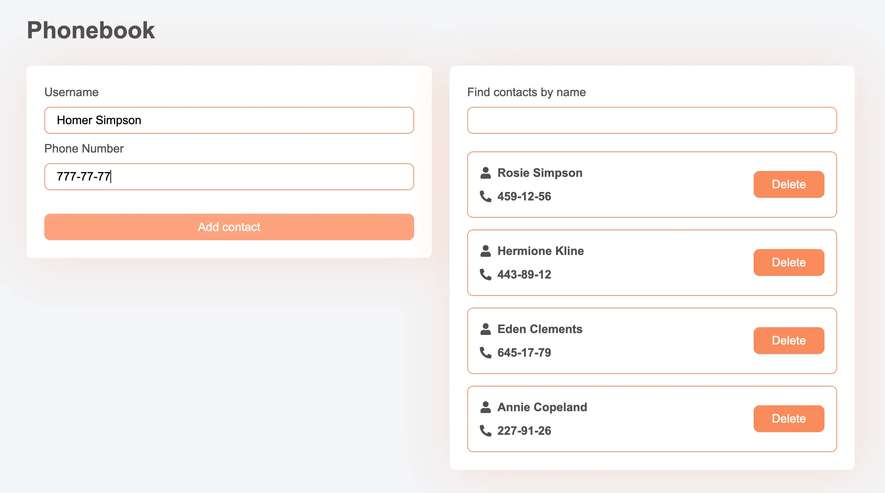

# React + Redux Phonebook App

## Module 6: Redux and Global State Managment

This repository contained the implementation of a phonebook application using React. The project was created with Vite, used Formik for forms, and styled components with CSS modules. The application had several key functionalities, which are summarized below:

## Functionality Summary

- **Contact Storage**:

  - Implemented a form to add new contacts.
  - Displayed a list of contacts.
  - Included a search box for filtering contacts by name.

- **Component Structure**:

  - Each component was organized in its own folder within `src/components`.
  - Default exports were used for all components.

- **Initial Contacts**:

  - Predefined contacts were hardcoded for development and testing purposes.

- **Search Functionality**:

  - Provided a search input field to filter contacts.
  - Filter logic was case-insensitive.

- **Form Validation**:

  - Used Formik for form creation.
  - Integrated Yup for validation, enforcing:
    - Required fields
    - Minimum of 3 characters
    - Maximum of 50 characters

- **Adding Contacts**:

  - Implemented functionality to add contacts with `name`, `number`, and a unique `id` generated using `nanoid`.

- **Deleting Contacts**:

  - Allowed users to delete contacts from the list.

- **Local Storage**:

  - Contacts were saved in local storage upon addition and deletion.
  - On application load, contacts were retrieved from local storage and set in the state.

## Live Demo

- **Source Files**: [GitHub Repository](https://github.com/grifano/goit-react-hw-03.git)
- **Working Page**: [Live Preview](https://goit-react-hw-03-sooty-alpha.vercel.app/)

## Project Setup

1.  Clone the repository.
2.  Install dependencies: `npm install`
3.  Start the development server: `npm run dev`

## Code Quality

- Ensured no errors or warnings in the console.
- Maintained clean and understandable JavaScript code using Prettier for formatting.

## Acknowledgments

[GOIT](https://edu.goit.global/uk/referral?x=eyJlbWFpbCI6InNvcmxlbmtAZ21haWwuY29tIiwiZmlyc3ROYW1lIjoi0KHQtdGA0LPRltC5IiwibG9jYWxlIjoidWsiLCJsYW5ndWFnZSI6InVrIiwidG90YWxIb3VycyI6NzcsImN1cnJlbnRPckxhc3RUZWNobm9sb2d5IjoiSFRNTF9DU1MiLCJwYXNzZWRIb21ld29ya3NDb3VudCI6NX0=) -
big love to GoIT team for their patience, afford, help, and positivity that they
share with us ❤️

## Author

- Website - [www.grifano.com](https://grifano.com)
- Frontend Mentor -
  [www.frontendmentor.com](https://www.frontendmentor.io/profile/grifano)
- LinkedIn - [www.linkedin.com](https://www.linkedin.com/in/grifano/)
